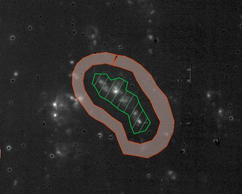

# polyphot
(c) Ralf Kotulla

Small repository holding scripts for extracting photometry within arbitrarily shaped polygons.

The main functionality is implemented in the polgon2flux.py script.

## What does it do?

in its simplest invocation, it takes user-defined regions in the form of a ds9 region file, and integrates the 
flux within each polygon. It supports customizable local background subtraction 
in an annulus of specified width, matching the overall shape of the chosen source 
polygon, with a customizable buffer zone between source and sky areas. All this can 
also be done consistently across images (without the need to match the images in 
pixel-space; polygons should be defined by world-coordinates (Ra & Dec) that are
recomputed for each frame. It also supports a mechanism to apply additional 
image-specific calibrations (e.g. to convert observed fluxes from counts into physical 
units and, with a specified distance, to luminosities). Optional check-images allow to verify 
proper functionality, and all results are written to a single, multi-band output file for ease of 
follow-up processing.

## Example polygon

In this example, the actual source region is selected by the green, 
hashed polygon. The sky annulus, separated by some dead space, is shown in 
the semi-transparent red region further out. Both width of the dead space
region and the sky annulus can be freely configured, and sky estimation also
includes some iterative sigma-clipping to avoid contamination due to nearby 
source for more robust results.

## Usage and options

    polygon2flux.py --region=my_regions.reg --output=my_catalog.cat file1.fits:band1 file2.fits:band2

### Important command line options:

* **--region** region filename for source definition

* **--output** filename for output catalog

* **files** list of input filenames

### Additional, optional command line options

* **--dryrun**
  dry-run 

* **--debug** output debug output

* **--checkimages** generate check-images

* **--deadspace** spacing between source aperture and sky perimeter [arcsec]

* **--skywidth** size for sky perimeter [arcsec]

* **--merge** filename for merged catalogs at the end

* **--nthreads N** number of parallel worker threads

* **--distance** distance to source in Mpc

* **--calibrate** calibration factor (format: filter:factor; e.g.: ha:1.e5e-9)')

* **--gain** gain (format: filter:gain; e.g.: ha:1.e5e-9; 
alternative: filter:!header_key)

* **--distance_to_center** if provided, calculate distance between source 
and center (format: HMS+dms, eg 14:23:45+23:45:56)

### Full example call

Below is one example listing a bunch of options, taken from a real-life run for the nearby galaxy IC342:

    ./polygon2flux.py \
        --region=regions3.reg \
        wiyn/halpha_continuumsub.fits:ha \
   	    galex/galex_nearUV.fits:nuv \
        --deadspace=2 \
        --skywidth=3 \
	    --distance=3.3 \
        --calibrate nuv:3.38e-28 ha:3.28e-18 \
	    --gain ha:!GAIN nuv:4200   \
        --distance_to_center=03:46:48+68:05:47 \
	    --output ic342_polyphot.csv

This command extracts photometry for a number of regions in both narrow-band H-alpha and GALEX near-UV data, 
corrects them for local background using a sky annulus slightly outside of each polygon, calculates the 
uncertainty of each measurement using the specified gain data, converts all raw integrated counts into physical
units and even absolute luminosities, and writes the resulting multi-band catalog to file.